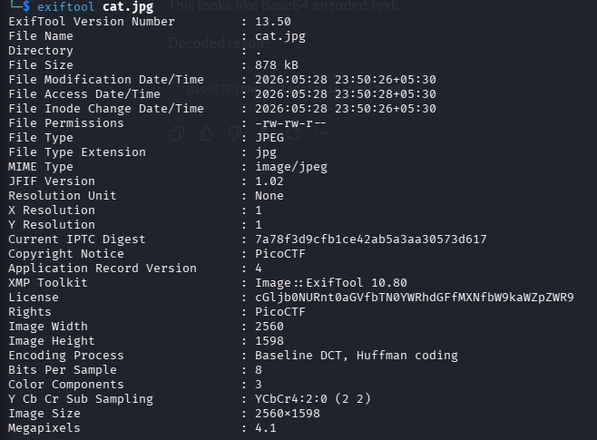

# Challenge Name: Information

**CTF:**  
**Category: Forensics**   
**Difficulty: Easy**  
**Points: 10**  
**Date: 28-05-26**  

---

## Description
> Files can always be changed in a secret way. Can you find the flag?

---

## Recon & Initial Observations
First, I opened the image manually to check if the flag was visually hidden in the picture.

```bash
eog cat.jpg
```

Nothing suspicious was visible in the image itself. 


---

## Approach / Thought Process
Since I got a image, this could possibly be a stegnography based ctf. So for every stegnography based ctf I follow a certain steps/workflow to analyze it and find the flag. And most of the easy and medium challenges can be solved using it, with some other fundamental knowledge. The steps include, checking the files true type, checking readable strings, checking the hexadecimal represenation,extracting the metadata, checking for LSB stegnography using zsteg, checking for embedded files, using stegsolve to check the different planes of the image for the flag or any useful data. Following this entire workflow can give the flag or can reveal useful details on how to proceed further.

In this the flag was found in the metadata, in a base64 encoded form.

---

## Solution:

### Step 1 — 
Used "exiftool" to find check the metadata of the image.

```bash
exiftool cat.jpg
```

The output revealed a field named **License** with an unusual base64 encoded value.
Base64 string: cGljb0NURnt0aGVfbTN0YWRhdGFfMXNfbW9kaWZpZWR9

 

### Step 2 — 
Decoded the base64 string using cyber chef to get **picoCTF{the_m3tadata_1s_modified}**, which was the flag.

---

## Tools Used
- exiftool
- cyberchef (website)

---

## Key Takeaway
Metadata in image files can contain hidden or sensitive information. 
Always run exiftool on any image file in a forensics challenge before 
anything else.

---

## Flag
`picoCTF{the_m3tadata_1s_modified}`
