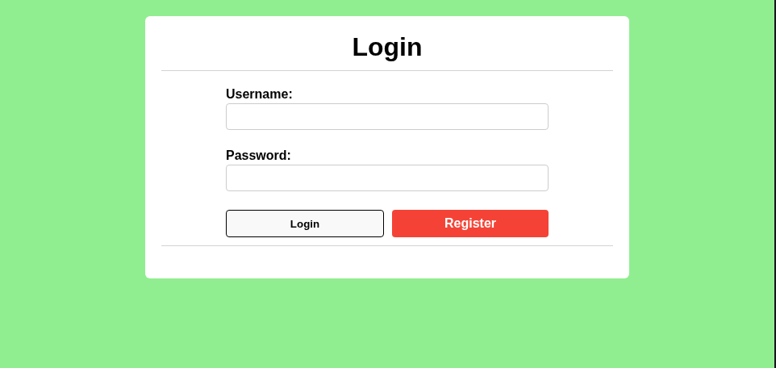
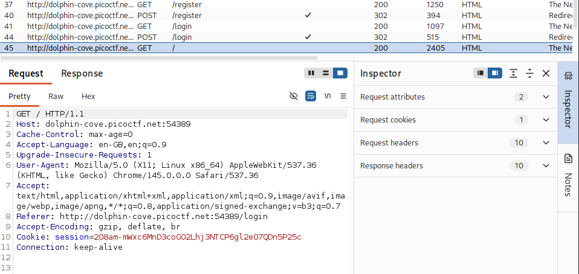
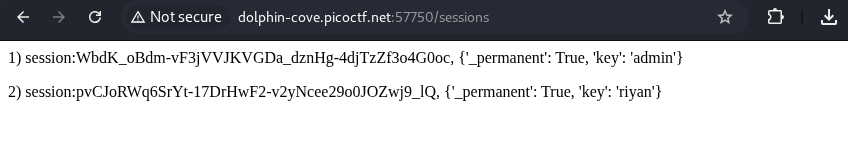
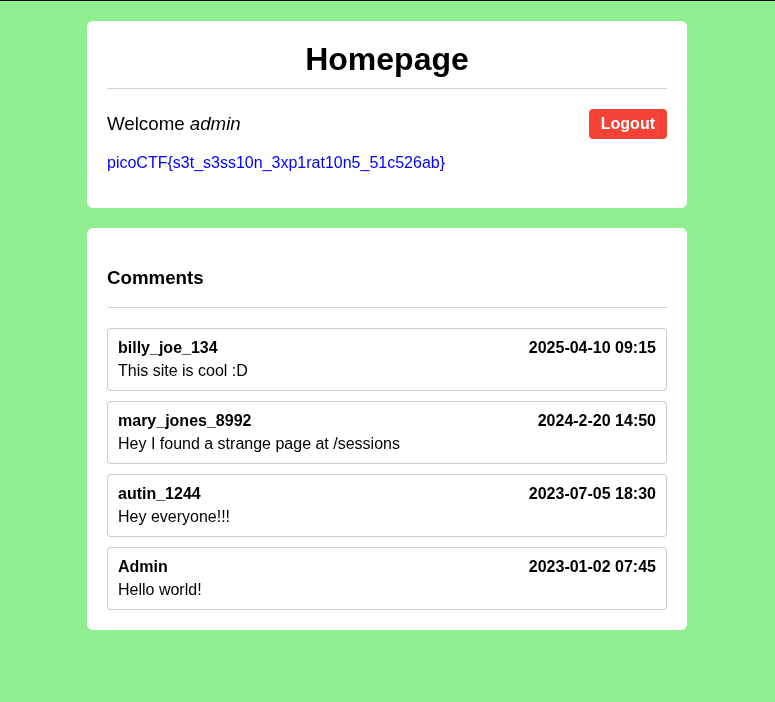

# Challenge Name: Old Sessions

**CTF:** 
**Category:**  Web 
**Difficulty:** Low
**Points:** 100
**Date:** 29-05-26

---

## Description
> Proper session timeout controls are critical for securing user accounts. If a user logs in on a public or shared computer but doesn’t explicitly log out (instead simply closing the browser tab), and session expiration dates are misconfigured, the session may remain active indefinitely.

This then allows an attacker using the same browser later to access the user’s account without needing credentials, exploiting the fact that sessions never expire and remain authenticated.

Your friend tells you to check out a new social media platform he built a few years ago. Although its still under development, he said the site is almost complete. He also mentioned that he hates constantly logging into sites, and so has made his page that 'once you login, you never have to log-out again'!

---

## Recon & Initial Observations

After registering and logging into the application, I began inspecting the traffic using Burp Suite.

While reviewing the requests and responses, I noticed that the application used a session token to identify authenticated users. Since session management vulnerabilities are common in web challenges, I initially investigated whether the session cookie contained useful information.

I attempted to decode the session token to determine whether it stored user data or any sensitive information. However, decoding the token did not reveal anything useful.

Further exploration of the application revealed a comments section. One of the comments referenced a /sessions endpoint, suggesting that additional functionality might be accessible through direct URL navigation.

---

## Approach / Thought Process
The presence of a session cookie suggested that authentication relied on session-based access control.

My initial hypothesis was that the challenge might involve decoding or manipulating the session token directly. After this approach failed, I shifted my focus toward discovering hidden functionality within the application.

The reference to /sessions in the comments appeared unusual and potentially intentional. Since CTF web challenges often hide sensitive functionality behind unlinked endpoints, I decided to manually browse to the page and investigate its contents.

---

## Solution

### Step 1 — Inspect Authentication Traffic
After creating an account and logging in, I intercepted the requests using Burp Suite and identified the session cookie assigned to my account.

### Step 2 — Enumerate Hidden Functionality
While reviewing the application, I came across a couple of comments, which had a reference to the /sessions endpoint.

Navigating directly to this endpoint revealed a list of active sessions, including an administrator session token.

### Step 3 — Session Hijacking
I copied the administrator's session token and replaced my own session cookie using Burp Suite.

After refreshing the application with the modified cookie, I was authenticated as the administrator.

### Step 4 - Retrieve the Flag
Once authenticated as the administrator, the flag was visible on the applications screen.

---

## Tools Used
- burp suite
- code chef

---

## Key Takeaway
Permanent sessions can be heavily exploited if a session token is exposed or leaked. An attacker can use the token to hijack a valid session, leading to unauthorized access and potential exposure of sensitive data. This challenge highlights the importance of secure session management and proper access controls to prevent session information from being disclosed to unauthorized users.

---

## Flag
`picoCTF{s3t_s3ss10n_3xp1rat10n5_51c526ab}`
